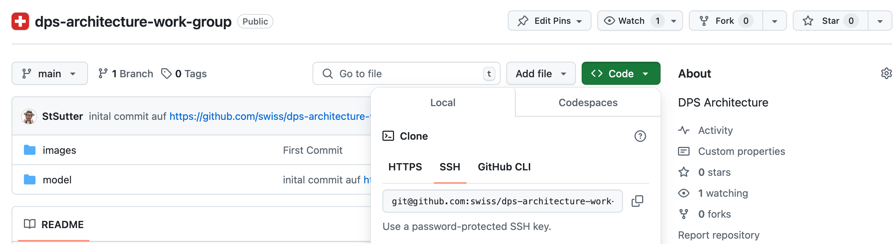
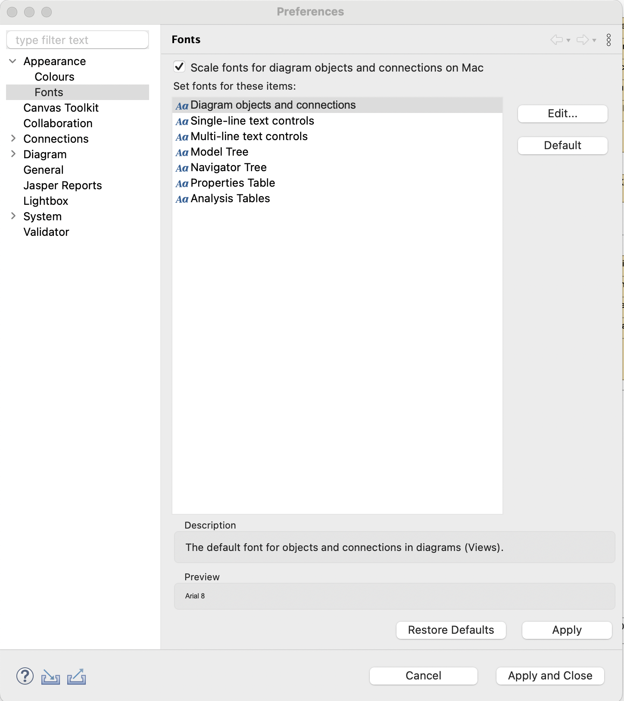
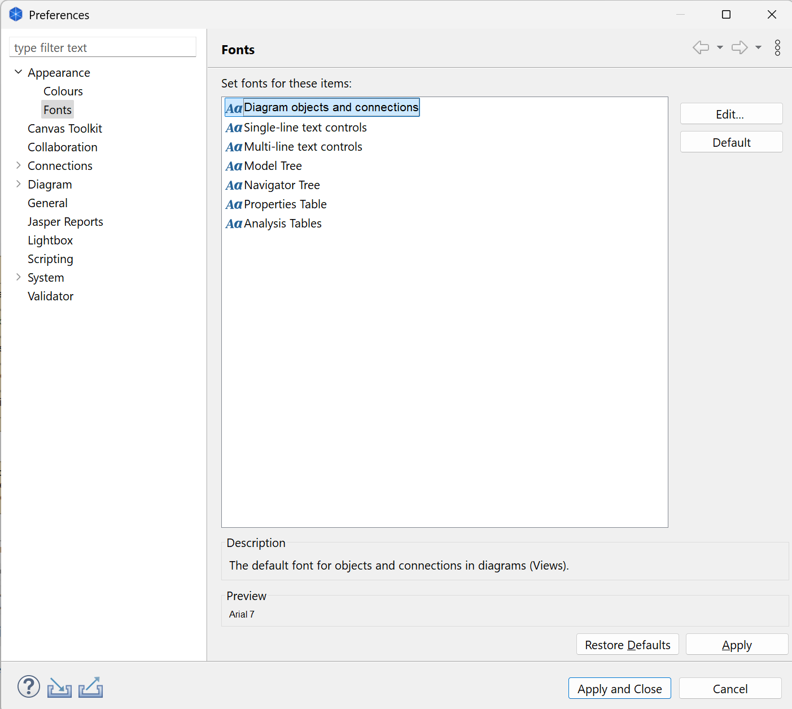

# dvs-architektur
DVS Arbeitsgruppe Architektur Archimate Repository 

How to collaborate with Archimate

Install the recent version of Archi: https://www.archimatetool.com/download/

Install the collaboration plugin

https://github.com/archimatetool/archi-modelrepository-plugin/wiki/Setup-and-Configuration

https://github.com/archimatetool/archi-modelrepository-plugin/wiki/Understand-the-Basics

the access with ssh works well with gitlab and github, if you only want to read the repository, no need to make the push setup
https://github.com/archimatetool/archi-modelrepository-plugin/wiki/SSH-Authentication

For push setup, an account with active MFA is needed, make shure the E-Mail adress of the github account and the ssh key match
There are two passwords, the identity password for the ssh key to be set in the field in the preferences, one for the archi-credentials witch are requested from archi dialog and can be set with change primary password.

Import a model 
https://github.com/archimatetool/archi-modelrepository-plugin/wiki/Manage-Workspace

credentials depends if using ssh or https with personal access token

After succesful import you should see this

The default fonts need to be adapted from default to Arial 7 for Mac and Arial 7 for Windows

Collaboration, please ask for access or create a pull-request
